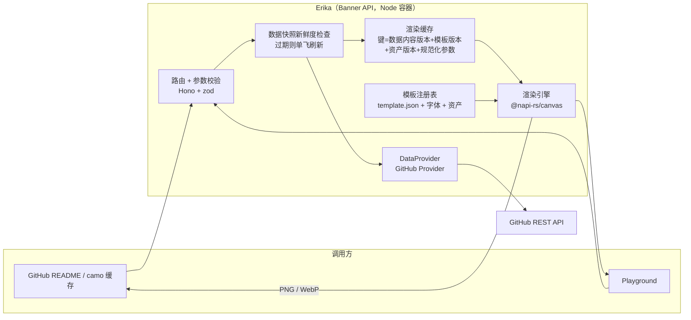

# Erika（絵里香）项目设计案（v2）

> **命名**：Erika（絵里香）——「为仓库绘制肖像的画师少女」OC。Erika 延续项目角色名传统（Muika、Muice、Muyan、Rikka），且「絵」字自带画的含义；服务吉祥物可复用 GPT-Image 流程生成。
>
> **目标**：Erika 是一个 shields.io 风格的项目 Banner 生成服务——把 `MAS-banner.psd` 这类手工排版的封面 Banner，升级为 URL 驱动的动态渲染：访问一个 URL，就自动拉取 GitHub 仓库名称、星标数等信息，按模板渲染出 Banner 图片，并提供前端 Playground 改善预览体验。
>
> 本文档是设计阶段的产出，先定框架与项目结构，不包含实现代码。

**v2 修订说明**（吸收评审意见）：

1. 缓存流程重排：先做数据新鲜度检查，缓存键纳入数据内容版本，ETag 改为图片字节哈希（第 3、6、7 节）。
2. 缓存时间表逐项定义，注明认证前提与次级限流，`fresh=1` 语义修正（第 6 节）。
3. 收敛图标来源，补全资源限制与 SSRF 前提，明确拒绝私有仓库（第 7.2、10、12 节）。
4. 字体归属修正：Torus Pro 由 Paulo Goode 设计、MyFonts（Monotype）发行；授权按三个场景拆分（第 2.3、12 节）。
5. 新增 `classic-stats` 模板，让首版可以完成"星标展示→数据变化→同 URL 更新"的验收；SVG 移出首版（第 5、7、13 节）。（v3：`classic` / `classic-stats` 已合并为 `grokbot` 模板，元数据改为每模板声明的 topline/footer 两区；头像走独立的 `avatar` 模板。）
6. 主题同时控制全部前景色；补齐文本溢出、分词、字体回退规则；CJK 改用完整字体或定义覆盖范围（第 5.3 节）。
7. 模板、主题、项目预设、Provider、Renderer 五层拆分；"加模板不改代码"限定为既有绘制能力的组合（第 5 节）。
8. PSD 提取的已验证项与未完成项分开表述，视觉基线改用 Photoshop 导出成品（第 2.3、11 节）。

## 1. 背景与目标

### 1.1 现状

- Banner 由 PSD 手工排版：左侧图标是 GPT-Image-2.5 生成的插画（提示词来自 grokbot-icon-studio），右侧上方是项目名、下方是描述。
- 已存在两套同构模板：`MAS-banner.psd`（Muika-After-Story）与 `Rikka-banner.psd`（Nonebot-Plugin-Rikka），说明"一套布局骨架、多个项目复用"已经发生。
- 成品图（`assets/banner.webp`，约 44 KB）直接内嵌在 GitHub README 中，由 camo 代理缓存。
- 痛点：星标数等动态数据无法自动更新；每接一个新项目都要手工改 PSD；排版知识只存在于 PSD 文件里，无法程序化复用。

### 1.2 目标

1. URL 驱动：`GET /v1/banner/:owner/:repo.png` 即可拿到渲染好的 Banner。
2. 数据自动获取：仓库名、星标数、描述等来自 GitHub API，带缓存、限流降级与可验证的更新链路。
3. 模板可扩展：PSD 退居"设计稿源文件"，通过提取器变成模板数据；在既有绘制能力内，新增模板不改服务代码。
4. 开发者体验：提供 Playground 在线预览、调参、导出 README 代码片段。
5. 可行优先：技术栈在 Windows 开发机与 CI 上都能零编译痛点地运行。

### 1.3 非目标（首版不做）

- 不做通用徽章服务，只做"项目 Banner"这一垂直场景。
- 不做用户账号体系；**只服务公开仓库**，对返回 `private: true` 的数据一律按不存在处理（见 6.4 节）。
- 不支持任意远程图标 URL 与 SVG 输出（列入后续路线，见第 13 节）。

## 2. 现有模板分析（PSD 逆向实测）

用 `psd-tools 1.19.0` 解析两份 PSD，得到以下实测数据。这份分析直接决定模板 schema 的设计。

### 2.1 画布与图层

| 项目 | MAS-banner | Rikka-banner |
|------|-----------|--------------|
| 画布 | 3000×1800（5:3） | 3000×1800（5:3） |
| 背景层 | 纯色 `#24201F` | 纯色 `#0C0C0E` |
| 图标（智能对象） | 1212×1212，位于 (264, 294) | 1220×1220，位于 (150, 286) |
| 标题文本层 | bbox (1505, 683)–(2779, 793) | bbox (1424, 695)–(2763, 790) |
| 描述文本层 | bbox (1500, 1012)–(2863, 1369)，手动换行 4 行 | bbox (1430, 1010)–(2760, 1267) |

### 2.2 文本样式（逐 run 实测）

| 样式项 | MAS 标题 | Rikka 标题 | 描述（两份一致） |
|--------|----------|-----------|------------------|
| 字体 | Torus SemiBold | Torus SemiBold | Torus SemiBold |
| 字号 | 93.99 px | **81.46 px** | 58.33 px |
| 字距（Tracking） | 100（0.1 em） | 100（0.1 em） | 100（0.1 em） |
| 颜色 | 逐词首字母 `#AB6B55`，其余 `#FFFFFF`（run 长度 1,5,1,5,1,5） | 逐词首字母 `#867FC5`，其余 `#E9E4E9` | MAS 全 `#999999`；Rikka 含 `#FF6666` 强调词 run |
| 换行 | 单行 | 单行 | 手动 `\r` 硬换行 |

两个新发现，直接影响模板设计：

1. **Rikka 标题字号缩小到 81.5 px**——同一布局骨架下，长标题（"Nonebot–Plugin-Rikka" 比长）靠人工缩字号解决。这正是模板需要 `autoFit` 规则的直接证据（见 5.3 节）。
2. **描述也存在强调色 run**（Rikka 的 `#FF6666`）。还原它属于新增绘制能力（`accentRanges`），是第 5.5 节"需要扩展 Renderer"的实例，首版不承诺。

### 2.3 关键结论

1. **布局高度参数化**：两套模板只有图标内容、颜色主题、文案不同，骨架完全一致。字号、位置、颜色都可作为模板变量。
2. **文本是唯一动态部分**：图标是位图智能对象，背景是纯色。服务端渲染只需处理"文本绘制 + 位图合成"。
3. **字体是最大的授权风险**：Torus Pro 由 Paulo Goode 设计，MyFonts（Monotype）发行，商业授权；PSD 中的 CJK 回退字体 AdobeHeitiStd 是 Adobe 授权字体，不可再分发。授权需按"服务器安装 / 渲染成品分发 / 字体文件再分发"三个场景分别确认，详见第 12 节。
4. **PSD 提取已验证的范围（实事求是）**：
   - 已验证：图标智能对象原图（1212×1212 PNG）完整导出；背景色读出；字体清单、逐 run 字号/字距/颜色/run 长度、手动换行结构均可程序化提取。
   - 未完成，列入 M1 验收：基线位置、变换矩阵、行高的提取与映射；不支持效果（阴影、描边等）的诊断输出；从提取数据生成完整 `template.json` 的工具化封装。
   - psd-tools 对图层合成与部分效果的支持有限（官方文档有明确说明），**它的合成结果不能当作 Photoshop 权威输出**。视觉基线一律以 Photoshop 导出成品（`assets/banner.png`）为准。

## 3. 总体架构



请求处理顺序（与缓存语义强绑定）：

1. 解析路径与查询参数，zod 校验，超限直接拒绝。
2. 读取仓库数据快照并检查新鲜度；过期则触发刷新（单飞合并并发请求，见 6.2 节）。
3. 以 **数据内容版本（如 stargazers_count、description 的哈希）+ 模板版本 + 资产版本 + 规范化参数** 生成渲染缓存键，命中则直接返回图片。
4. 未命中则由模板引擎计算布局、渲染引擎出图，回写渲染缓存。
5. **ETag = 最终图片字节的哈希**，保证内容变化时 ETag 随之变化；响应附 `Cache-Control`，交给 camo / CDN 做边缘缓存。

数据获取与渲染都必须做单飞（single-flight）：同一 key 的并发请求合并为一个任务，避免一次过期引发重复拉取和重复渲染。

## 4. 技术选型

### 4.1 渲染引擎（核心决策）

| 方案 | 优点 | 缺点 | 结论 |
|------|------|------|------|
| **@napi-rs/canvas** | Skia 内核，napi-rs 预编译二进制，Windows/macOS/Linux 开箱即用；性能优于 node-canvas；命令式 API 对绝对定位、图片合成、逐字符着色都是强项 | 输出位图，SVG 需另做 | **推荐** |
| satori + resvg | JSX→SVG→PNG，矢量输出，可跑边缘运行时（Vercel OG 同源方案） | 布局仅支持 flexbox 子集；绝对定位与逐字符配色表达别扭；双层依赖 | 备选 |
| node-canvas | 社区老牌 | Cairo/Pango 系统依赖，Windows 与 CI 编译痛点 | 不选 |
| skia-canvas | 功能全 | 维护活跃度一般，安装体积大 | 不选 |
| Puppeteer 截图 | 还原度天花板（真浏览器排版） | 内存开销大、冷启动慢、Docker 镜像重 | 不选 |

选 @napi-rs/canvas 的核心理由：本场景是"PSD 式绝对定位排版 + 位图合成"，命令式绘制最自然；shields.io 也是服务端出图的路子。**首版只输出 PNG / WebP**；SVG 属于新增渲染能力，列入 M5，首版路由、参数枚举与 `/v1/meta` 均不声明支持。

输出格式上，实测成品：PNG 约 812 KB，WebP 约 44 KB（同画面）。**默认输出 WebP**，README 与 camo 均支持，体积差 18 倍；PNG 作为可选格式保留。

### 4.2 服务框架与语言

| 项 | 选择 | 理由 |
|----|------|------|
| 语言 / 运行时 | TypeScript / Node ≥ 22 | 与 Playground 共享类型；生态成熟 |
| HTTP 框架 | Hono + `@hono/zod-openapi` | 轻量、类型安全、OpenAPI 文档自动生成（自文档化 API） |
| 参数校验 | zod | 同上 |
| 包管理 / 仓库 | pnpm monorepo | 前后端与工具链同仓，类型一处定义 |
| 缓存 | 内存 LRU（按字节上限）→ 可插拔 KV 接口 | 单实例内存缓存支撑早期流量；Redis / Cloudflare KV 后续按需接入 |
| 字体子集化 | fonttools（可选，构建期） | Torus 全量仅数十 KB，非瓶颈；CJK 策略见 5.3 节 |

### 4.3 为什么不是 Rust / Python

- Rust（axum + resvg）性能最好，但开发效率与 Playground 类型共享差，现阶段不划算。
- Python（FastAPI + Pillow）文本排版能力弱（无 letterSpacing 精确控制、harfbuzz 支持一般），且与前端共享模板元数据困难。

## 5. 模板系统设计（可扩展性的核心）

### 5.1 五层拆分

| 层 | 职责 | 产物 |
|----|------|------|
| 模板（Template） | 布局：画布、文本框、图标位、统计区、默认样式、能力声明 | `template.json` + 字体引用 |
| 主题（Theme） | 各区域颜色（背景、标题、强调、描述、统计） | 模板内 `themes` 变量 |
| 项目预设（Preset） | 项目与仓库的绑定：图标资产、展示标题、定制描述、主题选择 | 本地配置文件（首版） |
| Provider | 获取外部数据（GitHub 等） | `packages/providers` |
| Renderer | 执行已支持的绘制能力 | `packages/core` |

数据解析顺序：**请求参数 > 项目预设 > Provider 数据 > 模板默认值**。没有项目预设的陌生仓库也能出图（图标回退到 GitHub 头像，文案回退到仓库描述）。

### 5.2 PSD → 模板提取器（psd-toolkit）

开发期 CLI（Python + psd-tools，本次调研已验证部分可行性），职责：

1. 导出背景色、图层资产（图标智能对象原图）。
2. 读取文本层的坐标、字号、字距、行高、逐 run 颜色与长度，写入 `template.json`。
3. 对不支持的图层效果输出诊断（类型 + 图层名 + "未还原"），不静默丢弃。

**提取器验收证据清单**（M1 通过条件）：

- 使用的 PSD 文件、提取器版本与运行命令；
- 生成的 `template.json` 全文；
- 字号、变换、基线、行高、颜色与 PSD 原值的对应关系表；
- 明确支持的 PSD 图层类型列表，以及不支持效果的诊断输出。

### 5.3 template.json（v3：比例版式）

```jsonc
{
  "schemaVersion": 1,
  "id": "grokbot",
  "version": 1,                       // 模板内容版本，参与缓存键
  "capabilities": {                   // /v1/meta 据此声明可用参数
    "autoFit": true, "manualLineBreaks": true,
    "wordInitialAccent": true, "accentRanges": false, "statsSlot": false
  },
  "canvas": { "width": 3000, "height": 1800 },
  "defaults": { "theme": "dark", "scale": 0.5 },
  "layout": {                         // 全部是画布比例，由 erika-psd induce 归纳
    "iconBlend":   { "x": 0.069, "centerY": 0.4989, "size": 0.4053, "fit": "cover" },
    "iconCard":    { "x": 0.076, "centerY": 0.5,    "size": 0.332,  "fit": "contain" },
    "title":       { "x": 0.4882, "inkTop": 0.3828 },
    "description": { "x": 0.4884, "top": 0.5616 },
    "text":        { "rightEdge": 0.9543 }   // maxWidth = rightEdge - x
  },
  "slots": {                          // 只放排版度量（字号/字距/行距），不放位置
    "title": {
      "font": "Torus SemiBold", "fontFallback": ["Quicksand", "Baloo 2", "Comfortaa"],
      "size": 125.0, "tracking": 0.1,
      "accentMode": "word-initial",       // 按分词规则取每词首字符
      "tokenize": "[-_\\s]|[\\u4e00-\\u9fff]",  // 连字符/下划线/空格分词，中文逐字
      "autoFit": { "mode": "scale-down", "minScale": 0.7 },  // 缩至 0.7 倍为下限
      "overflow": "ellipsis"              // 到下限仍超宽则截断加省略号
    },
    "description": {
      "font": "Torus SemiBold", "fontFallback": ["Quicksand", "Baloo 2", "Comfortaa"],
      "size": 58.33, "tracking": 0.1, "leading": 1.75, "maxLines": 4,
      "wrap": "manual-first",             // 优先保留显式换行，超长再自动折行
      "overflow": { "mode": "ellipsis" }  // 超出 maxLines 截断加省略号
    },
    "icon": {
      "fit": "contain", "radius": 0, "padding": 0,
      "sources": ["repo", "builtin"]   // 该模板适用的来源，见 5.3 图标策略
    },
    "meta": {                               // 元数据两区，锚定文字块而非固定坐标
      // size 56 是 README 可读性下限：3000px 画布在约 830px 内容列里只剩 27.7%，
      // 56×0.277≈15.5px 屏幕字号；42 会掉到 11.6px 而难以辨认
      "size": 56, "tracking": 0.04, "color": "stats", "accent": "accent",
      "separator": "·", "separatorGap": 0.5,
      // gap 是墨迹间距（描述墨迹底 → 元数据墨迹顶）：设计里标题→描述的墨迹间距是
      // 0.114H≈206px，元数据取一半 0.055H≈99px，既跟随描述（短描述不留空洞）又不贴住它
      "topline": { "gap": 0.028, "fields": ["full_name"] },
      "footer":  { "gap": 0.055, "fields": ["stars", "forks", "issues", "release"] }
    }
  },
  "themes": {                              // 主题同时控制全部前景色，保证亮色可读
    "dark":  { "background": "#24201F", "title": "#FFFFFF", "accent": "#AB6B55", "description": "#999999" },
    "light": { "background": "#F5F1EC", "title": "#1C1815", "accent": "#9A5A42", "description": "#6B6259" }
  },
  "fonts": ["Torus-SemiBold.otf", "Baloo2-SemiBold.ttf", "NotoSansSC-SemiBold.ttf"]
}
```

`layout` 由加载器展开为绝对像素（`iconBlend` → `slots.iconBlend`，`iconCard` → `slots.icon`，标题/描述/文字列右缘 → 各槽位的 `x`/`inkTop`/`top`/`maxWidth`），渲染层仍然只认识绝对坐标。

文本规则补充说明：

- **缺字回退**：主字体缺字（如 Torus 无 CJK 字形）时按 `fontFallback` 链回退；回退字体在模板声明并随模板分发。
- **CJK 策略**：放弃"构建期按内容子集化"——仓库描述是任意动态文案，构建时无法预知字符集。首版携带完整的服务端 CJK 字体（Noto Sans SC 全量约 10 MB，容器内可接受），后续可改为"定义覆盖范围的固定子集 + 完整回退字体"。
- **元数据（v3）**：颜色用主题里的 `stats` 键（比 `description` 亮一档，避免小字在缩放后失去对比）。不再有 classic / classic-stats 的变体分法——每个模板都声明 `meta` 槽位（topline 在标题上方、footer 在描述下方），字段取 `stars` / `forks` / `issues` / `release` / `full_name`，按 shields 惯例格式化（`9 → "9"`、`4200 → "4.2k"`；release 原样输出 tag）。位置是**锚定 + 墨迹间距**的：topline 基线 = 标题墨迹顶 − gap（gap 即墨迹间距）；footer 基线 = 描述墨迹底 + gap + 元数据墨迹高度——按 ink 而不是基线计算，避免"看起来贴住描述"。跟随描述而不是固定坐标，短描述不会像旧的固定 top 那样留下空洞。实测（Rikka，3 行描述，3000×1800）：描述末行墨迹底 1270 → 元数据墨迹顶 1371，间距 100px，正好是设计标题→描述节奏（206px）的一半。`?meta=` 表示全部关闭，`?meta=stars,release` 取子集（模板未声明的字段返回 400）。
- **模板示例**：`grokbot`（默认）与 `avatar`（`extends: grokbot`，只覆盖图标盒位与来源）。

**版式与图标策略**（2026-09-28 评审后确立：版式比例化 + 两条图标路径）：

- **版式一律是比例**：`template.json` 的 `layout` 块只写画布比例（图标边长/横向位置/垂直中心，标题与描述的 x 与锚点，文字列右缘），由 `erika-psd induce` 从两份参考 PSD 程序化归纳（可复跑，输出每个样本的比值与离散度），加载时展开成绝对像素。模板里不再出现任何具体项目的像素值；预设也不再携带版式，只描述"这个项目提供了什么"（图标资产、主题配色）。
  - 归纳结果（见 `packages/templates/grokbot.json`）：图标边长 0.4053W（样本 0.404–0.4067）、垂直中心 0.4989H（0.4978–0.5）、标题 x 0.4882W / inkTop 0.3828H、描述 x 0.4884W / top 0.5616H、文字列右缘 0.9543W。尺寸与垂直方向离散 ≤12px；横向是最松的一项（图标 x 0.05–0.088W，两样本差 114px）——这正是"同一主题、各自落地"的差异，统一模板取均值后，两个参考项目的横向偏差 ≤57px（1.9%W），垂直 ≤9px。
- **两条模板路径**（`grokbot` / `avatar`，由图标来源决定，不靠采样结果碰运气）：
  - **`grokbot` 模板**（项目自带图标 / 模板默认图标）：素材是"主体 + 纯色底"的整幅插画；模板的 `iconBlend` 比例盒定位、`fit: cover` 满幅绘制，画布底色采用捕获到的背景色完成融合；素材底色不纯时退到同模板的 `iconCard` 盒。
  - **`avatar` 模板**（GitHub 头像等任意不透明图片）：只保留 `iconCard` 比例盒，`fit: contain` 缩小 + 移动，右缘与文字列保持 240px 间距（参考画布下 1224 → 1465），不参与背景捕获——头像角上的纯色不会重绘画布。
  - **图标供给（公开路径）**：项目自带图标放在**主题仓库**的约定路径（`assets/grokbot-icon.{webp,png,jpg}`，可用 `?iconPath=` 或预设覆盖），经 `raw.githubusercontent.com` 拉取（主机固定、路径只允许仓库内相对路径并做穿越校验）；仓库没有该文件时回落到模板的默认 Grokbot 图标（`packages/templates/assets/grokbot-default.webp`，其右上角空白满足采样判据，已纳入单测）。`?icon=auto`（默认）走这条链，`?icon=builtin` 强制默认图标，`?icon=avatar` 走头像模板。
  - `fit` / `padding` / `radius` 仍在槽位声明并可用 `iconFit` / `iconRound` 覆盖；同一路径内显示行为与来源无关，**盒位**由路径决定。
- **背景捕获**：Grokbot 素材的右上角按设计留白，因此采样该区域（内缩 2px、窗口 ≤64px、通道极差 ≤24）判定"纯色底"，取平均色作为画布底色。实测：两份随仓库素材 + 两份 PSD 原始导出共 5 个样本，旧的全边框 8 点采样 5/5 失败（左缘是角色本体），右上区域采样 5/5 通过（极差 2–12）。这是当前"识别 Grokbot 图标"的判据，需要更多独立样本验证；头像不参与捕获（否则头像角上的纯色会重绘整张画布）。
- **颜色策略**：① 透明图片直接与模板背景合成；② 已知纯色底图片由作者在预设中指定匹配底色（`themeOverrides`），需要时提供亮暗两套资产（`icon.pathLight`）；③ 照片/复杂背景走卡片路径。不承诺任意不透明图片无缝融入任意主题。

### 5.4 项目预设（首版为仓库内本地配置）

```jsonc
// apps/api/presets/presets.json —— 部署者维护，随镜像分发
{
  "Moemu/Muika-After-Story": {
    "template": "grokbot",
    "title": "Muika-After-Story",
    "description": null,               // null = 使用 GitHub 描述
    "icon": { "path": "assets/grokbot-icon.webp" },   // 主题仓库内的相对路径
    "theme": "dark",
    "themeOverrides": {}               // 可覆盖个别颜色（如 Rikka 的紫色系）
  }
}
```

不引入远程配置服务；预设是静态文件，改动走正常的构建与部署流程。

### 5.5 "新增模板不改代码"的边界

成立范围：**使用 Renderer 已声明的绘制能力，组合新模板、新主题、新预设，不需要改服务代码。**

不成立、需要扩展 Renderer 的例子：SVG 输出、描述内强调词（Rikka 的 `#FF6666` run，对应 `accentRanges` 能力）、二维码等新图元。这些按能力扩展流程走：能力声明 → Renderer 实现 → `capabilities` 更新 → `/v1/meta` 自动暴露。

## 6. 数据层设计（GitHub Provider）

### 6.1 数据获取

REST `GET /repos/{owner}/{repo}`，字段映射：

| Banner 用途 | API 字段 |
|-------------|----------|
| 项目名 | `name` / `full_name` |
| 描述 | `description` |
| 星标数 | `stargazers_count` |
| Fork 数 | `forks_count` |
| 图标（可选） | `owner.avatar_url` |
| 元信息 | `license.spdx_id`、`topics`、`html_url`、`private` |

数字按 shields 惯例格式化：`9 → "9"`、`4200 → "4.2k"`。

### 6.2 缓存与限流策略（可行性关键）

**认证是生产必需项，不是可选项。** 未认证配额只有 60 次/小时/IP，服务端必须配置 `GITHUB_TOKEN`（认证后 5000 次/小时）才能让 ETag 条件请求的省配额效果在真实流量下成立。

本地开发把 token 写进仓库根 `.env`（`cp .env.example .env`；`.env` 已在 `.gitignore` 中，模板见 `.env.example`）；`process.env` 里已有的同名变量优先，所以 CI / 平台的注入不会被文件覆盖。三条部署路线各自注入：Vercel 环境变量、Docker `-e`、Actions 的 `secrets.GITHUB_TOKEN`。变量名兼容 `GITHUB_TOKEN` 与 `GH_TOKEN`（后者与 gh CLI 一致）。

| 项 | 值 | 说明 |
|----|-----|------|
| 数据新鲜度 TTL | 30 分钟 | 过期后先返回旧值，后台单飞刷新 |
| 刷新方式 | ETag 条件请求 | 携带认证返回 304 时不计入主速率配额（GitHub 官方 best practice） |
| 最大陈旧上限 | 48 小时 | 超过视为数据不可用，渲染占位 Banner，不无限用旧值 |
| 边缘缓存 s-maxage | 1 小时 | README 星标更新的预期粒度（预期表现，M4 用真实 camo 链路验收，不作为承诺） |
| 仓库不存在负缓存 | 1 小时 | 防穿透 |
| 暂时性失败（超时/限流） | 60 秒 | 短缓存，避免雪崩，期间返回 stale 或占位 |

配套规则：

1. **渲染结果缓存**：同一"数据内容版本 + 模板版本 + 规范化参数"直接命中，不触 GitHub。命中率作为待实测指标（见第 10 节），不做容量承诺。
2. **单飞**：数据刷新与渲染都是合并并发的原子任务。
3. **次级限流**：GitHub 在高频请求时另有次级限流（secondary rate limit），与主配额无关。响应处理必须覆盖 `Retry-After` 与 `X-RateLimit-Reset` 头，指数退避，**不能把条件请求当作零成本轮询**。
4. **降级顺序**：GitHub 限流/超时 → 返回 stale 数据渲染；无 stale → 渲染"暂时不可用"占位图。永远不返回破图。
5. 多 token 轮换留作扩展点。

### 6.3 camo 缓存与数据新鲜度

GitHub README 中的图片经 camo 代理，camo 遵循源站的 `Cache-Control`：

- 正常响应：`Cache-Control: public, max-age=600, s-maxage=3600, stale-while-revalidate=86400`。
- **`fresh=1` 的正确语义**：该参数改变缓存键（渲染层视作不同请求），并令响应携带 `Cache-Control: no-cache`——camo 与浏览器必须带 ETag 回源验证，内容未变时返回 304。它**不能**清除其他 URL 的 camo 缓存，也不能保证绕过已缓存的 `?fresh=1` 自身副本；它的作用是把该 URL 变成"每次都验证"。
- `curl -X PURGE <camo-url>` 仅作为故障排查手段，GitHub 官方建议谨慎使用，不写进用户文档主路径。
- M4 验收必须包含真实链路测试：改动仓库数据（或用本地 mock 模拟）后，观察同一 README 图片 URL 的实际更新时间。

### 6.4 Provider 接口与私有仓库

`DataProvider` 定义为简单接口：`fetch(ctx) → BannerData`。GitHub 是第一个实现；npm、PyPI、crates.io 等未来按同一接口接入，模板侧无需感知数据来源。

**安全边界**：部署者可能配置高权限 Token。Provider 必须检查响应中的 `private` 字段，`private === true` 一律按"仓库不存在"处理并走负缓存，防止意外暴露私有仓库信息。

## 7. API 设计

### 7.1 路由（v1）

```text
GET /v1/banner/:owner/:repo(.png|.webp)        默认模板（Preset 声明，否则按图标来源取 grokbot / avatar）
GET /v1/banner/:owner/:repo/:template(.png|.webp)   指定模板
GET /v1/meta                                   模板/主题/能力清单（Playground 用）
GET /                                          OpenAPI 文档 + 用法首页
```

**URL 表达只保留一种形式**：模板只出现在路径，格式只出现在扩展名。不设 `template`、`format` 查询参数，避免双通道冲突规则。SVG 不在首版枚举中。

### 7.2 查询参数与限制

| 参数 | 示例 | 限制 | 说明 |
|------|------|------|------|
| `template` | — | 仅路径 | 见 7.1 |
| `theme` | `dark` / `light` | 枚举，来自 `/v1/meta` | 主题 |
| `title` | 自定义文案 | ≤ 80 字符 | 覆盖项目名 |
| `description` | 自定义文案 | ≤ 300 字符 | 覆盖描述；`description=` 表示留空 |
| `meta` | `stars,forks` | 枚举，模板 `meta` 槽位声明 | 元数据字段；`meta=` 表示全部关闭 |
| `icon` | `auto` / `avatar` / `builtin` | 枚举 | `auto` = 主题仓库图标 → 默认图标；首版**不支持任意 URL**（SSRF 见第 10 节） |
| `iconPath` | `assets/mine.webp` | 相对路径、≤128 字符、禁 `..` | 覆盖项目图标的仓库内路径 |
| `scale` | `0.5` | (0, 1] | 输出缩放，默认 0.5（1500×900） |
| `lang` | `en` / `zh` | 枚举 | 占位图文案语言 |
| `fresh` | `1` | — | 短缓存 + 必须验证（见 6.3 节） |

图标来源解析顺序：主题仓库约定路径（可覆盖）→ 模板默认 Grokbot 图标；头像只在显式 `icon=avatar` 时使用并切到 `avatar` 模板。请求 URL 总长度上限 4 KB（覆盖 300 个中文字符描述编码后的合法最坏情况；实测 camo 链路接受 4 KB 原 URL）。

### 7.3 响应、ETag 与错误分类

- 成功：图片字节 + `Content-Type` + `Cache-Control` + `ETag`（**图片字节哈希**，内容不变则 304 生效，内容变化则 ETag 必变）。
- 占位图类错误统一返回 200 + 图片（参考 shields，避免 README 破图），原因放在 `X-Banner-Error` 头；参数非法才返回 JSON 400。
- CORS：`Access-Control-Allow-Origin: *`；因 Playground 需要读取 `X-Banner-Error` 与调用 `/v1/meta`，另配 `Access-Control-Expose-Headers: ETag, X-Banner-Error`。普通 `` 标签预览不受 CORS 影响。
- 失败分类（不同原因不同缓存策略）：

| 情形 | 表现 | 缓存 |
|------|------|------|
| 仓库不存在 / 私有 | "not found" 占位图 | 负缓存 1 小时 |
| GitHub 限流 / 次级限流 | stale 图；无 stale 则"temporarily unavailable"占位图 | 60 秒 + `Retry-After` 退避 |
| 网络超时 | 同上，`X-Banner-Error: upstream-timeout` | 60 秒 |
| 参数非法 | JSON 400 | 不缓存 |

### 7.4 /v1/meta（能力自描述）

```jsonc
{
  "schemaVersion": 1,
  "templates": [
    {
      "id": "grokbot", "version": 1,
      "themes": ["dark", "light"],
      "capabilities": { "autoFit": true, "metadata": true },
      "sources": ["repo", "builtin"],
      "metaFields": ["full_name", "stars", "forks", "issues", "release"],
      "params": { "scale": [0, 1], "title": 80, "description": 300 }
    },
    { "id": "avatar", "sources": ["avatar"], "metaFields": ["full_name", "stars", "forks", "issues", "release"] }
  ],
  "metaFields": ["stars", "forks", "issues", "release", "full_name"],
  "formats": ["webp", "png"]
}
```

Playground 完全根据 `/v1/meta` 渲染参数面板，服务端新增能力时前端无需发版。

## 8. Playground 设计

单页应用（React 19 + Vite + **Tailwind CSS v4**，组件按 shadcn/ui 约定本地化，无 Radix 依赖），部署方案见第 10 节三路线。直接调用真实 API——**预览即生产**，不存在"预览环境渲染不一致"问题。M3 已实现：

- **URL 即状态**：全部参数编码进查询串（`?owner=&repo=&template=&theme=...`），链接即分享；
- **参数面板由 `/v1/meta` 驱动**：模板清单、主题、limits（title≤80 等）全部来自服务端能力声明；
- **GitHub README 模拟**：亮/暗背景（`#ffffff` / `#0d1117`）、830px 内容宽，预览图直接来自 API（fetch→blob→objectURL，可读取 `X-Banner-Error` 显示占位原因徽标）；
- **防抖 300ms + AbortController**：连续输入合并、过期请求取消，旧响应不覆盖新预览；
- **片段导出**：Markdown / 双主题 `<picture>` / 纯 URL 三种，附复制按钮；
- 界面字体使用系统栈（含 Microsoft YaHei / Noto Sans SC 回退）：中文环境零网络依赖（Google Fonts 在大陆不可用），品牌感由 Banner 本身承载。

功能：

1. **实时预览**：模拟 GitHub 亮色/暗色背景与 README 宽度（约 830 px）；**输入防抖 + AbortController 取消过期请求**，只采纳最新响应，防止旧图覆盖新预览。
2. **参数面板**：由 `/v1/meta` 驱动生成，与服务端能力天然同步。
3. **片段导出**：一键生成 Markdown 与 `<picture>`（亮暗双主题自适应）代码：
   ```html
   <picture>
     <source media="(prefers-color-scheme: dark)"
             srcset="https://erika.example.com/v1/banner/Moemu/Muika-After-Story.webp?theme=dark" />
     
   </picture>
   ```
4. **URL 即状态**：所有参数编码进 Playground 的查询串，链接可直接分享。
5. **模板画廊**：从 `/v1/meta` 拉取模板清单展示缩略图。

复用 `packages/shared` 中的模板与参数类型，前后端同构定义，避免两处漂移。

## 9. 项目结构

```text
erika/
├─ apps/
│  ├─ api/                     # Hono 服务入口、路由、中间件、presets/、Dockerfile
│  └─ playground/              # React + Vite 预览前端
├─ packages/
│  ├─ core/                    # 布局计算 + 渲染引擎（纯函数，无 I/O，可单测）
│  ├─ templates/               # 模板 JSON、字体、内置资产（数据即代码）
│  ├─ providers/               # DataProvider 接口 + GitHub 实现
│  ├─ shared/                  # 类型、参数 schema、数字格式化（前后端共用）
│  └─ psd-toolkit/             # PSD→模板提取 CLI（Python，开发期工具）
├─ docs/                       # 设计文档、API 文档、模板制作指南
├─ .github/workflows/          # CI：测试、视觉回归、镜像构建
├─ pnpm-workspace.yaml
└─ README.md
```

分层要点：

- `core` 不碰网络与文件系统，输入模板 + 数据 + 参数，输出图片——最可测试、最可能被复用（CLI、测试、服务端渲染）的部分。
- `templates` 是纯数据包；"加模板不动代码"由它和能力声明机制共同保证。
- `psd-toolkit` 是独立的 Python 工具，不进生产镜像。
- 项目预设放在 `apps/api/presets/`，属于部署配置而非代码。

## 10. 部署与运维

### 10.0 部署路线（社区项目三路线，M3 起生效）

作为社区项目，不假设用户持有 VPS 或付费服务。三条自托管路线：

| 路线 | 前端 | 图片生成 | 用户需要准备 | 状态 |
|------|------|----------|--------------|------|
| **A. Vercel 一键部署（优先推荐）** | Vercel 静态 CDN | Vercel Node Function（`api/index.ts` + `hono/vercel`） | 平台账号、仓库副本、GitHub Token | M3 已建入口（`vercel.json` + `api/index.ts`），**M4 需线上验证**：打包路径、includeFiles、冷启动与字体加载、rewrites 后 hono 取到的原始路径 |
| **B. Docker 自托管** | 容器内托管（Hono `serveStatic`）或独立静态 CDN | Node 容器 | 可运行 Docker 的环境 | M4 落地 Dockerfile |
| **C. GitHub Actions 定时生成** | 不需要（Banner 为仓库内提交的静态文件） | 工作流调用 `erika render-live` CLI | 仓库与工作流配置（GITHUB_TOKEN 由 Actions 自动提供） | **M3 已可用**（示例见 `docs/examples/refresh-banner.yml`） |

路线 A/C 说明：

- 每个部署者使用自己的 `GITHUB_TOKEN`（5000 req/h），配额按部署者隔离——这是自托管路线的核心优势；
- Serverless 无跨实例内存缓存：内存 LRU 退化为实例内缓存，边缘缓存（Vercel CDN 尊重 `s-maxage`）+ camo + ETag 条件请求承担主要缓存职责，设计不受破坏；
- 路线 C 的星标新鲜度 = cron 粒度；文件无变化时不产生提交（工作流内 `git diff` 守卫）。

### 10.1 资源限制（公开服务的自我保护）

| 限制项 | 首版值（待实测调整） |
|--------|---------------------|
| `scale` 上限 | 1.0 |
| 文案长度 | title ≤ 80、description ≤ 300 字符 |
| 请求 URL 总长 | ≤ 4 KB（含 scheme+host；见 7.2 说明） |
| 图标下载（未来开放 URL 时） | ≤ 5 MB、解码后 ≤ 4096×4096 像素、总耗时 ≤ 5 s |
| 渲染并发 | 固定 worker 池（如 4）+ 队列上限（如 64），溢出返回 503 并短缓存 |
| 内存渲染缓存 | 按字节上限（如 512 MB）的 LRU，按图片字节数计重 |

文案覆盖与图标参数会产生近乎无限的缓存键组合，**不能依赖"参数组合有限"**——防线是：参数长度上限 + 按 IP 限流 + 缓存字节上限三者叠加。

### 10.2 SSRF 前提与后续要求

首版图标只允许三类来源（预设资产、GitHub 头像、内置图），不存在用户可控的出网请求，SSRF 面被消除。**未来开放任意图标 URL 前**，必须实现 OWASP SSRF 防护清单中的完整措施：校验实际连接目标（连接后复核 IP）、重定向逐跳重新校验或直接禁止、覆盖 IPv6 与链路本地地址段、DNS 解析后二次校验防 TOCTOU、仅允许 https。在此之前，路由与文档不得暴露该能力。

### 10.3 形态与观测

- **形态**：Node 容器（Dockerfile 多阶段构建），部署到 Fly.io / Cloud Run / 自托管 VPS 任一；无状态，横向扩容靠缓存前置。
- **观测**：渲染耗时（含字体加载、图片解码、编码分项）、渲染缓存命中率、GitHub 配额余量。**以下数字在压测前一律视为待测，不作容量依据**：单次渲染耗时、"95% 请求命中缓存"之类的比例、并发峰值。压测报告在 M2/M4 补充。
- **自保护**：按 IP 限流（或交给反代/CDN）；基础日志 + 健康检查端点。

## 11. 视觉保真与回归

验收分两步，基线来源不同：

1. **设计稿对比（人工验收）**：API 渲染结果与 **Photoshop 导出成品**（`assets/banner.png`）并排对比，人工接受字体度量差异（如自动缩放导致的字号偏差）。psd-tools 的合成结果仅用于开发调试，不作为基线。
2. **CI 回归（机器验收）**：人工验收通过后的 API 渲染结果固化为基线，后续用 pixelmatch 一类工具做像素 diff，差异超阈值即失败。

用例集：MAS 与 Rikka 两仓库、一个陌生仓库（头像图标 + 自动文案）、超长标题（触发 autoFit 下限与省略号）、超长描述（触发折行与截断）、中英混排、纯中文描述。

## 12. 风险与对策

| 风险 | 影响 | 对策 |
|------|------|------|
| **Torus Pro 字体授权**（Paulo Goode / MyFonts / Monotype，商业授权；商品页 Desktop 许可明确排除服务器安装） | 法务风险，阻塞性 | 按三个场景分别确认持有的许可是否覆盖：(a) 服务器安装字体并渲染出图——通常需要专门的许可；(b) 对外分发渲染后的 PNG/WebP——多数许可涵盖，仍需核对；(c) 字体文件进入公开仓库或容器镜像——再分发权，风险最高，默认禁止。**首版公开模板默认使用 OFL 字体**（候选 Baloo 2 / Quicksand / Comfortaa，视觉对比验收后选定）；Torus 作为部署者自有许可的可选配置（运行时从本地路径加载，不进入公开仓库与镜像），模板 `fonts` 字段支持多候选与回退 |
| CJK 字体 | 中文描述渲染与体积 | 完整服务端字体（Noto Sans SC，约 10 MB）优先；"定义覆盖范围的固定子集 + 完整回退"作为后续优化。不做按内容子集化（动态文案不可预知） |
| camo 缓存导致数据延迟 | 数据新鲜度 | 时间表见 6.2/6.3 节；M4 用真实链路验收更新粒度；`fresh=1` 提供强制验证通道；PURGE 仅排障 |
| GitHub 主/次级限流 | 服务降级 | 认证 + ETag 条件请求 + SWR + 单飞；处理 `Retry-After` / `X-RateLimit-Reset`；返回 stale 或占位，不破图 |
| 滥用（海量不同参数刷渲染） | CPU / 配额 | 参数长度上限 + IP 限流 + 缓存字节上限 + 渲染队列上限（见 10.1 节） |
| 私有仓库信息泄露 | 安全 | Provider 校验 `private` 字段，按不存在处理（见 6.4 节） |
| 图标 URL 的 SSRF | 内网探测 | 首版不支持任意 URL 消除攻击面；开放前落实 OWASP 完整措施（见 10.2 节） |
| 仓库被删 / 转私有 | 破图 | 渲染占位 Banner，永不返回 404 破图 |

## 13. 里程碑与首版范围

### 13.1 首版范围

**两条模板路径（`grokbot` / `avatar`）＋完整亮暗主题＋三类图标来源＋仓库标题与描述＋元数据（stars/forks/issues/release/仓库全名）＋可靠缓存＋Playground。**

用 MAS、Rikka 和一个陌生仓库验证复用能力，之后再扩展 SVG、更多 Provider 与任意远程图标。

### 13.2 里程碑

| 阶段 | 内容 | 验收 |
|------|------|------|
| M1 | psd-toolkit 提取器 + `core` 渲染引擎 + 模板 + 字体选型落地 | 提取器满足 5.2 节证据清单；CLI 渲染 MAS/Rikka 与 Photoshop 成品对比通过人工验收 |
| M2 | api 服务：路由、参数、GitHub Provider、缓存、错误分类、`/v1/meta` | **关键链路验收**：同一 README 图片 URL 在仓库数据变化后更新；GitHub 暂时不可用时按既定策略降级显示；MAS、Rikka、陌生仓库三仓库复用通过 |
| M3 | Playground：预览、调参、片段导出、URL 分享 | 生成片段贴入 README 正常显示，亮暗主题自适应 |
| M4 | 部署上线 + 文档 + README 替换 | 真实 camo 链路实测数据更新粒度并记录；压测报告补充 |
| M5（后续） | SVG 输出、`accentRanges` 能力、任意远程图标（含完整受限下载）、更多 Provider、元数据字段扩展（license/language/last-updated 等） | 按需排期 |

M2 的关键链路（数据变化 → 同 URL 更新 → 故障降级）是整个项目从"PSD 排版"升级为"动态 Banner 服务"的完成标志，跑不通则视为 M2 未完成。

## 14. 参考资料

- shields.io Endpoint Badge（JSON schema 与缓存语义的参照）：https://shields.io/badges/endpoint-badge
- shields 自托管文档：https://contributing.shields.io/
- Vercel OG / satori（SVG 路线参照）：https://github.com/vercel/satori
- @napi-rs/canvas：https://github.com/Brooooooklyn/canvas
- GitHub REST best practices（条件请求、主/次级限流）：https://docs.github.com/en/rest/using-the-rest-api/best-practices-for-using-the-rest-api
- GitHub camo 匿名化 URL 与缓存：https://docs.github.com/en/authentication/keeping-your-account-and-data-secure/about-anonymized-urls
- RFC 9110 ETag 语义：https://www.rfc-editor.org/rfc/rfc9110.html#name-etag
- OWASP SSRF Prevention Cheat Sheet：https://cheatsheetseries.owasp.org/cheatsheets/Server_Side_Request_Forgery_Prevention_Cheat_Sheet.html
- Torus Pro（Paulo Goode / MyFonts / Monotype，含授权说明标签页）：https://www.myfonts.com/collections/torus-font-monotype-imaging
- psd-tools 支持范围说明：https://psd-tools.readthedocs.io/en/latest/

---

### 附录：调研产物与证据现状

- **解析脚本**：`tmp/psd_dump*.py`（结构探查）、`tmp/psd_extract_styles.py`（最终版逐 run 样式提取）。
- **干净证据产物**：`tmp/psd_export/mas_styles.json`、`rikka_styles.json`（画布、文本层 bbox、字体清单、逐 run 字号/字距/颜色/run 长度、段落属性）；`mas_SO_*.png`（图标原图 1212×1212）；背景与主题色已写入 2.1 节。
- **局限**：早期产物 `*_engine.json` 含解析失败的错误字段，仅作过程记录；基线位置、变换矩阵、行高映射、不支持效果诊断等项**未完成**，已列入 M1 验收清单（5.2 节）。迁移到正式仓库后，`psd_extract_styles.py` 即 psd-toolkit 的起点。
- **实测成品体积**：`banner.png` 812 KB / `banner.webp` 44 KB（3000×1800）。
